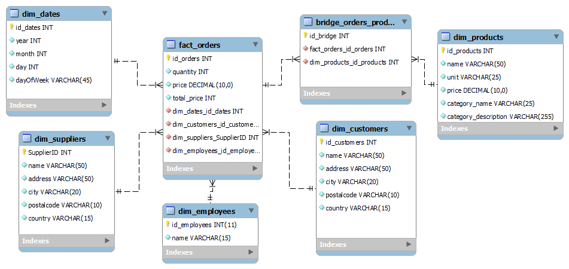
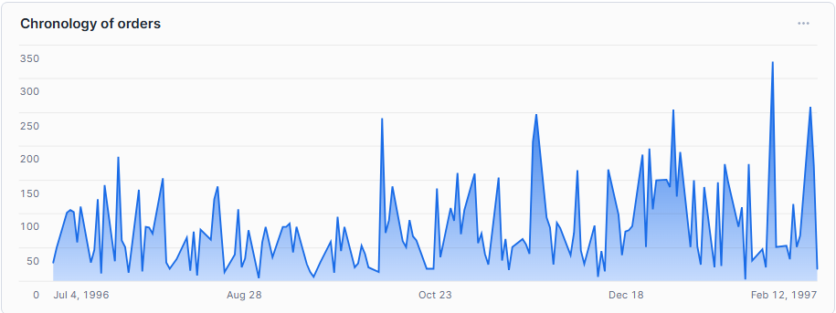
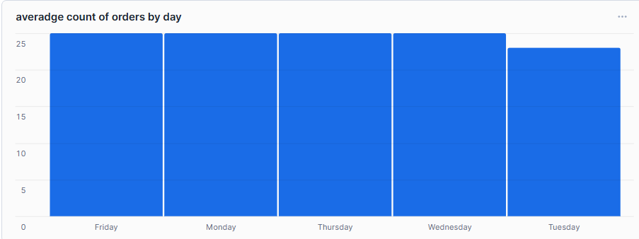
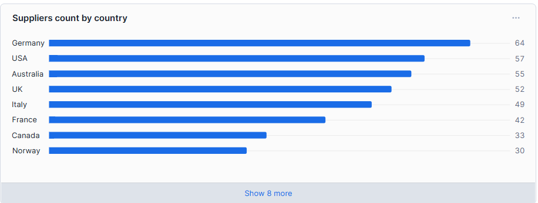
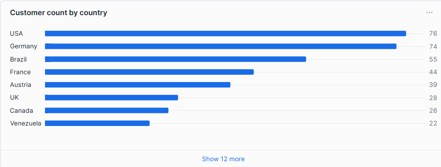
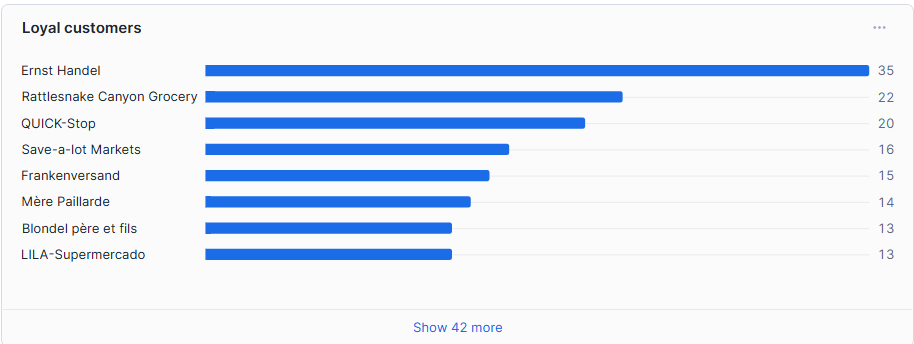
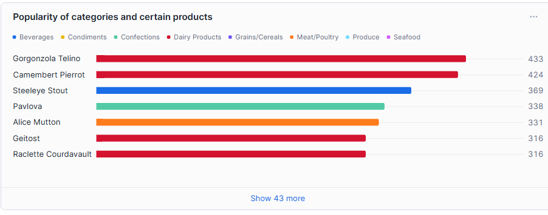

# **ETL proces datasetu NorthWind**
Toto úložisko obsahuje implementáciu procesu ETL softvéru Snowflake na analýzu údajov zo súboru údajov **NorthWind**. Proces zahŕňa kroky na extrakciu, transformáciu a načítanie údajov o objednávkach, zákazníkoch, kategóriách, produktoch, zamestnancoch a ďalších relevantných entitách do dimenzionálneho modelu. Výsledný dátový model umožňuje viacrozmernú analýzu a vizualizáciu kľúčových ukazovateľov.

---
## **1. Úvod a popis zdrojových dát**
Cieľom semestrálneho projektu je analyzovať dáta týkajúce sa predaja, zákazníkov a ich objednávok. Táto analýza umožňuje identifikovať trendy v predajných preferenciách, najpredávanejšie produkty a správanie zákazníkov.

Zdrojové údaje [tu] (https://github.com/microsoft/sql-server-samples/tree/master/samples/databases). 
Súbor údajov obsahuje päť hlavných tabuliek:
- `categories`
- `products`
- `suppliers`
- `shippers`
- `orderdetails`
- `orders`
- `customers`
- `employees`

Účelom ETL procesu bolo tieto dáta pripraviť, transformovať a sprístupniť pre viacdimenzionálnu analýzu.  

---
### **1.1 Dátová architektúra**

### **ERD diagram**
ERD diagram **NothWind**:

<p align="center">
  
  <br>
  <em>Obrázok 1 Entitno-relačná schéma NothWind</em>
</p>

---
## **2 Dimenzionálny model**

Navrhnutý bol **hviezdicový model (star schema)**, ktorý umožňuje efektívnu analýzu údajov z Northwind databázy. Centrálnu časť predstavuje faktová tabuľka **`fact_orders`**, ktorá je prepojená s nasledujúcimi dimenziami:
- **`dim_products`**: Obsahuje podrobné informácie o produktoch (názov, jednotka, cena, názov kategórie, popis kategórie).
- **`dim_customers`**: Obsahuje demografické údaje o zákazníkoch (meno, adresa, mesto, PSČ, krajina).
- **`dim_suppliers`**: Obsahuje údaje o dodávateľoch (meno, adresa, mesto, PSČ, krajina).
- **`dim_employees`**: Obsahuje informácie o zamestnancoch, ktorí spracovali objednávky (meno).
- **`dim_dates`**: Obsahuje podrobné údaje o dátumoch objednávok (deň, mesiac, rok, deň v týždni).

Pre reláciu medzi produktmi a objednávkami bola použitá prepojovacia tabuľka bridge_orders_products, ktorá umožňuje správne mapovanie relácie N:M medzi objednávkami a produktmi.

Struktúra hviezdicového modelu je znázornená na diagrame. Tento model je optimalizovaný pre analýzu predajných trendov, správania zákazníkov a výkonnosti produktov.

<p align="center">
  
  <br>
  <em>Obrázok 2 Schéma hviezdy pre NothWind</em>
</p>

---
## **3. ETL proces v Snowflake**
ETL proces pozostával z troch hlavných fáz: `extrahovanie` (Extract), `transformácia` (Transform) a `načítanie` (Load). Tento proces bol implementovaný v Snowflake s cieľom pripraviť zdrojové dáta zo staging vrstvy do viacdimenzionálneho modelu vhodného na analýzu a vizualizáciu.

---
### **3.1 Extract (Extrahovanie dát)**
Dáta z `.csv` súborov boli nahrané do Snowflake pomocou interného stage nazvaného `ostrich_stage`. Tento stage slúži ako dočasné úložisko na import a export dát. Bol vytvorený nasledovným príkazom:
```sql
CREATE OR REPLACE STAGE ostrich_stage FILE_FORMAT = (TYPE = 'CSV' FIELD_OPTIONALLY_ENCLOSED_BY = '"');
```

`.csv` súbory pre produkty, objednávky, zákazníkov a iné entity boli nahraté do zodpovedajúcich staging tabuliek pomocou príkazu `COPY INTO`. Podobný príkaz bol použitý pre každú tabuľku:
```sql
COPY INTO products_staging
FROM @ostrich_stage/products.csv
FILE_FORMAT = (TYPE = 'CSV' FIELD_OPTIONALLY_ENCLOSED_BY = '"' SKIP_HEADER = 1);
```

Parameter `SKIP_HEADER` zabezpečil ignorovanie hlavičkových riadkov v zdrojových súboroch, pričom konzistentné formátovanie zabezpečilo bezchybné nahrávanie.

---
### **3.2 Transfor (Transformácia dát)**
Počas tejto fázy boli dáta zo staging tabuliek očistené, transformované a obohatené, aby sa vytvorili dimenzie a faktové tabuľky optimalizované na analýzu. Kľúčové transformácie zahŕňali odstraňovanie duplicít, obohacovanie atribútov a odvodenie hierarchií.

#### **3.2.1 Dimenzionálne tabuľky**

**Dimenzie zákazníkov a dodávateľov**: Mapované údaje zákazníkov a dodávateľov na ID adries pre jednoduchšie spojenia. Typ dimenzie SCD1 (Slowly changing dimensions - Overwrite old value) pre zákazníkov a dodávateľov.
```sql
CREATE OR REPLACE TABLE dim_customers AS 
SELECT
    c.id AS customer_id,
    c.customername AS name,
    address,
    city,
    postalCode,
    country
FROM customers_staging c;
```
```sql
CREATE OR REPLACE TABLE dim_suppliers AS 
SELECT
    s.id AS supplier_id,
    s.suppliername AS name,
    address,
    city,
    postalCode,
    country
FROM suppliers_staging s;
```

**Dimenzia zamestnancov** (`dim_employees`): Kombinované mená a priezviská zamestnancov na vytvorenie úplných mien. Typ dimenzie SCD1 (Slowly changing dimensions - Overwrite old value).
```sql
CREATE OR REPLACE TABLE dim_employees AS
SELECT 
    id as employee_id,
    firstname || ' ' || lastname AS name
FROM employees_staging;
```

**Dimenzia dátumu** (`dim_date`): Analyzované dátumy objednávok na odvodenie roka, mesiaca, dňa a dňa v týždni. Typ dimenzie SCD0 (Slowly changing dimensions - Retain original value)
```sql
CREATE OR REPLACE TABLE dim_date AS
SELECT
    DISTINCT
    TO_DATE(TO_TIMESTAMP(orderdate, 'YYYY-MM-DD HH24:MI:SS')) AS date,
    DATE_PART('year', TO_TIMESTAMP(orderdate, 'YYYY-MM-DD HH24:MI:SS')) AS year,
    DATE_PART('month', TO_TIMESTAMP(orderdate, 'YYYY-MM-DD HH24:MI:SS')) AS month,
    DATE_PART('day', TO_TIMESTAMP(orderdate, 'YYYY-MM-DD HH24:MI:SS')) AS day,
    CASE DATE_PART(dow, TO_TIMESTAMP(orderdate, 'YYYY-MM-DD HH24:MI:SS')) 
        WHEN 1 THEN 'Monday'
        WHEN 2 THEN 'Tuesday'
        WHEN 3 THEN 'Wednesday'
        WHEN 4 THEN 'Thursday'
        WHEN 5 THEN 'Friday'
        WHEN 6 THEN 'Saturday'
        WHEN 7 THEN 'Sunday'
    END AS dayOfWeekAsString
FROM orders_staging;
```

#### **3.2.2 Faktová tabuľka**
Tabuľka `fact_orders` bola vytvorená na ukladanie kľúčových transakčných dát, spájajúcich dimenzie s odvodenými metrikami, ako sú cena a množstvo produktov.
```sql
CREATE OR REPLACE TABLE fact_orders AS
SELECT
    o.id AS order_id,
    od.quantity AS product_quantity,
    ps.price AS product_price,
    (od.quantity * ps.price) AS total_price,
    b.id AS bridge_id,
    TO_DATE(TO_TIMESTAMP(o.orderDate, 'YYYY-MM-DD HH24:MI:SS')) AS date_id,
    e.employee_id,
    ps.supplierId AS supplier_id,
    c.customer_id AS customer_id
FROM orders_staging o
JOIN bridge_orders_products b ON o.id = b.orderid
JOIN orderdetails_staging od ON b.orderid = od.orderid AND b.productid = od.productid
JOIN products_staging ps ON b.productid = ps.id
JOIN dim_employees e ON o.employeeid = e.employee_id
JOIN dim_customers c ON o.customerid = c.customer_id;
```

---
### **3.3 Nahrávanie dát (Load)**
Po transformáciách boli dimenzionálne a faktové tabuľky naplnené dátami. Staging tabuľky boli následne odstránené na optimalizáciu úložného priestoru.
```sql
DROP IF EXISTS products_staging;
DROP IF EXISTS orders_staging;
DROP IF EXISTS customers_staging;
DROP IF EXISTS categories_staging;
DROP IF EXISTS employees_staging;
DROP IF EXISTS orderdetails_staging;
DROP IF EXISTS shippers_staging;
DROP IF EXISTS suppliers_staging;
```

---
## **4 Vizualizácia dát**
Bolo vytvorených `6 vizualizacii`, ktoré poskytujú základný prehľad o kľúčových metrikách a trendoch týkajúcich sa objednávok, zákazníkov, produktov a predaja.

---
### **Graf 1. Chronologia objednávok**
<p align="center">
  
  <br>
  <em>Obrázok 3 Chronologia objednávok</em>
</p>

To nám umožňuje vidieť chronológiu objednávok v čase. Z grafu napríklad vyplýva, že ľudia si častejšie objednávajú v zime ako v lete.
```sql
SELECT SUM(product_quantity), date_id, FROM fact_orders GROUP BY date_id;
```
---
### **Graf 2. Priemerný počet objednávok za deň**
<p align="center">
  
  <br>
  <em>Obrázok 4 Priemerný počet objednávok za deň</em>
</p>

Tento graf zobrazuje najčastejšie objednávané dni v týždni.
```sql
SELECT ROUND(AVG(f.product_quantity),0), d.dayofweekasstring FROM fact_orders f JOIN dim_date d ON f.date_id = d.date GROUP BY d.dayofweekasstring;
```
---
### **Graf 3. Počet dodávateľov podľa krajiny**
<p align="center">
  
  <br>
  <em>Obrázok 5 Počet dodávateľov podľa krajiny</em>
</p>

Môžeme tiež zistiť, odkiaľ pochádza tovar pre zákazníkov. Tu vidíme, že prvým dodávateľom tovaru je Nemecko. 
```sql
SELECT s.country, COUNT(s.country) as count FROM fact_orders f JOIN dim_suppliers s ON f.supplier_id = s.supplier_id GROUP BY s.country ORDER BY count DESC;
```
---
### **Graf 4. Počet zákazníkov podľa krajiny**
<p align="center">
  
  <br>
  <em>Obrázok 6 Počet zákazníkov podľa krajiny</em>
</p>

V grafe priemerného počtu zákazníkov podľa krajiny môžete vidieť, že najčastejšie sú to ľudia z USA. Na druhom mieste je s malým rozdielom Nemecko.
```sql
SELECT c.country, COUNT(c.country) as count FROM fact_orders f JOIN dim_customers c ON f.customer_id = c.customer_id GROUP BY c.country ORDER BY count DESC;
```
---
### **Graf 5. Lojálni zákazníci**
<p align="center">
  
  <br>
  <em>Obrázok 7 Lojálni zákazníci</em>
</p>

Graf zobrazuje najvernejších zákazníkov obchodu zoradených podľa počtu objednávok. Na prvom mieste je Ernst Handel s 35 objednávkami, nasleduje Rattlesnake Canyon Grocery s 22 objednávkami a QUICK-Stop s 20 objednávkami. Medzi prvými tromi a ostatnými je vidieť pomerne veľký rozdiel.
```sql
SELECT c.name, COUNT(f.product_quantity) as count FROM fact_orders f JOIN dim_customers c ON f.customer_id = c.customer_id GROUP BY c.customer_id, c.name ORDER BY count DESC;
```
---
### **Graf 6. Obľúbené kategórie a konkrétne produkty**
<p align="center">
  
  <br>
  <em>Obrázok 8 Obľúbené kategórie a konkrétne produkty</em>
</p>

Graf zobrazuje obľúbenosť rôznych kategórií a produktov podľa počtu objednávok. Lídrami sú výrobky z kategórie „Mliečne výrobky“, ako napríklad „Gorgonzola Telino“ a „Camembert Pierrot“, čo zdôrazňuje vysoký dopyt po mliečnych výrobkoch. „Steeleye Stout“ z kategórie ‚Nápoje‘ je na treťom mieste, čo poukazuje na záujem o nápoje. Vysokú popularitu vykazujú aj výrobky z rôznych kategórií vrátane mäsa a cukroviniek. Celkovo graf odráža rozmanitosť preferencií zákazníkov a vysoký podiel mliečnych výrobkov medzi obľúbenými položkami.
```sql
SELECT f.product_quantity, p.productname, p.categoryname FROM fact_orders f JOIN bridge_orders_products b ON f.bridge_id = b.id JOIN dim_products p ON b.productid = p.product_id ORDER BY f.product_quantity DESC;
```

**Autor:** Antonina Zakharova
